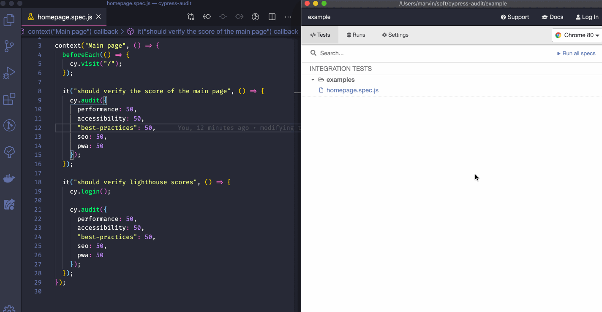

<p align="center">


</p>

<h5 align="center">
Run Lighthouse audits directly in your Cypress E2E test suites.
</h5>

---

[Why cypress-audit](#why-cypress-audit) · [Usage](#usage) · [Examples](#examples)

## Why cypress-audit?

[Lighthouse](https://developers.google.com/web/tools/lighthouse) is an amazing tool that allows to verify some metrics of a specific webpage. It measures _performances_, _accessibility_, _best practices_, _seo_ and _pwa_ and provides a score between 0 and 100 (100 being the maximum) for each of them. These metrics are subjective but generally useful to verify that we don't have too much regressions while modifying our applications.

The main problem that I see with Lighthouse is that we tend to use it to only verify the homepage of an application. It's easy to take for granted that an application is in good health testing only the main page of an app.

This modules aims to provide an easy way to verify lighthouse score as part of your E2E flows:

- you write your assumptions in JavaScript
- your verify the scores based on the _current_ Cypress page (the result of `cy.url()`)
- you can take advantage of your custom Cypress commands (like authentication :rocket:)

## Usage

### Installation

To make `cypress-audit` working in your project, you have to follow these **3 steps**:

- In your favorite terminal:

```sh
$ yarn add -D cypress-audit
# or
$ npm install --save-dev cypress-audit
```

- In the `cypress/plugins/index.js` file:

```javascript
const { audit, prepareAudit } = require("cypress-audit");

module.exports = (on, config) => {
  on("before:browser:launch", (browser = {}, launchOptions) => {
    prepareAudit(launchOptions);
  });

  on("task", {
    audit
  });
};
```

- In the `cypress/support/commands.js` file:

```javascript
import "cypress-audit/commands";
```

### In your code

After completing the [Installation](#installation) section, you can now use the `cy.audit` command inside your tests.

```javascript
it("should verify the lighthouse scores", function() {
  cy.audit();
});
```

By default, if you don't provide any argument to the `cy.audit` command, you will verify each metric against their maximum value: each metric should have a score of `100` or the test will fail.

#### Thresholds per tests

You can make assumptions on the different metrics by passing an object as argument to the `cy.audit` command:

```javascript
it("should verify the lighthouse scores with thresholds", function() {
  cy.audit({
    performance: 85,
    accessibility: 100,
    "best-practices": 85,
    seo: 85,
    pwa: 100
  });
});
```

Running this tests, if the Lighthouse analysis returns scores that are under the one set in arguments, the test will fail.

You can also make assumptions only on certain metrics. For example, the following test will **only** verify the "correctness" of the `performance` metric:

```javascript
it("should verify the lighthouse scores ONLY for performance", function() {
  cy.audit({
    performance: 85
  });
});
```

This test will fail only when the `performance` metric provided by Lighthouse will be under `85`.

#### Globally set thresholds

While I would recommend to make per-test assumptions, it's possible to define general metrics inside the `cypress.json` file as following:

```json
{
  "lighthouse": {
    "performance": 85,
    "accessibility": 50,
    "best-practices": 85,
    "seo": 85,
    "pwa": 50
  }
}
```

_Note: This metrics are overriden by the per-tests one._

## Examples

The [example](./example) folder of this projects owns some examples that you can run or look into. To get them working locally:

- Get the project

```shell
$ git clone https://github.com/mfrachet/cypress-audit
$ cd cypress-audit
$ yarn # or `npm install`
```

- Start the application

```shell
$ yarn start
```

- Run the tests (in another terminal)

```shell
$ yarn e2e # to open Cypress UI
$ yarn e2e:headless # to run the tests headlessy, in the terminal
```

Here's what you can expect from the library:


