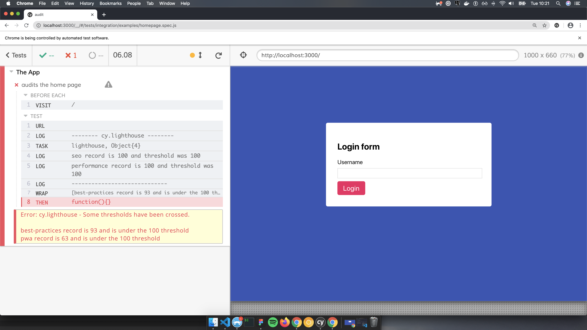

# cy.lighthouse()

Directly use Lighthouse in your Cypress test suites.



## Good to know before

Lighthouse is a tool that is supposed to run against a production bundle for computing the `performance` and `best-practices` metrics. But it's widely suggested by [Cypress to run their test on development environment](https://docs.cypress.io/guides/getting-started/testing-your-app.html#Step-1-Start-your-server). While this seems a bit counter intuitive, we can rely on the [Cypress project feature](https://docs.cypress.io/guides/guides/command-line.html#cypress-run-project-lt-project-path-gt) to run some dedicated test suites against production bundles and to have quick feedbacks (or prevent regression) on these metrics.

## Thresholds per tests

If you don't provide any argument to the `cy.lighthouse` command, the test will fail if at least one of your metrics is under `100`.

You can make assumptions on the different metrics by passing an object as argument to the `cy.lighthouse` command:

```javascript
it("should verify the lighthouse scores with thresholds", function () {
  cy.lighthouse({
    performance: 85,
    accessibility: 100,
    "best-practices": 85,
    seo: 85,
    pwa: 100,
  });
});
```

If the Lighthouse analysis returns scores that are under the one set in arguments, the test will fail.

You can also make assumptions only on certain metrics. For example, the following test will **only** verify the "correctness" of the `performance` metric:

```javascript
it("should verify the lighthouse scores ONLY for performance and first contentful paint", function () {
  cy.lighthouse({
    performance: 85,
    "first-contentful-paint": 2000,
  });
});
```

This test will fail only when the `performance` metric provided by Lighthouse will be under `85`.

## Globally set thresholds

While I would recommend to make per-test assumptions, it's possible to define general metrics inside the `cypress.json` file as following:

```json
{
  "lighthouse": {
    "performance": 85,
    "accessibility": 50,
    "best-practices": 85,
    "seo": 85,
    "pwa": 50
  }
}
```

_Note: These metrics are override by the per-tests one._

## Passing options and config to Lighthouse directly

You can also pass any argument directly to the Lighthouse module using the second and third options of the command:

```js
const thresholds = {
  /* ... */
};

const lighthouseOptions = {
  /* ... your lighthouse options */
};

const lighthouseConfig = {
  /* ... your lighthouse configs */
};

cy.lighthouse(thresholds, lighthouseOptions, lighthouseConfig);
```

#### Available metrics

With Lighthouse 6, we're now able to make assumptions on **categories** and **audits**.

The categories are what we're used to with Lighthouse and provided a score between 0 and 100:

- performance
- accessibility
- best-practices
- seo
- pwa

The audits are things like the first meaningful paint and the score is provided in milliseconds:

- first-contentful-paint
- largest-contentful-paint
- first-meaningful-paint
- load-fast-enough-for-pwa
- speed-index
- estimated-input-latency
- max-potential-fid
- server-response-time
- first-cpu-idle
- interactive
- mainthread-work-breakdown
- bootup-time
- network-rtt
- network-server-latency
- metrics
- uses-long-cache-ttl
- total-byte-weight
- dom-size
