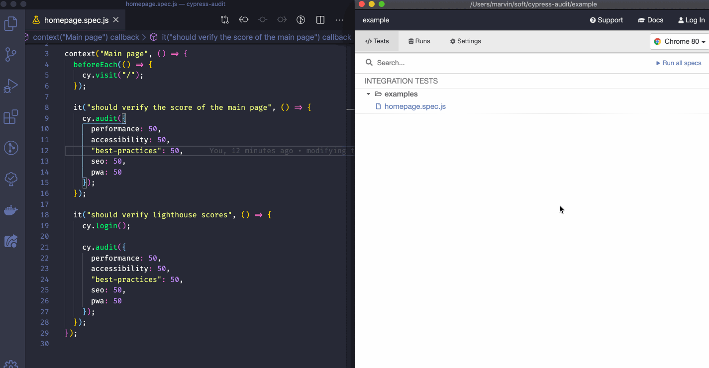

## Examples

The [example](./example) folder of this projects owns some examples that you can run or look into. To get them working locally:

- Get the project

```shell
$ git clone https://github.com/mfrachet/cypress-audit
$ cd cypress-audit/example
$ yarn # or `npm install`
```

- Start the application in production mode

```shell
$ yarn build
$ yarn serve build -s -l 3000
```

- Run the tests (in another terminal)

```shell
$ yarn e2e:audit # to open Cypress UI and play with the audit project
$ yarn e2e:audit:headless # to run the tests headlessy, in the terminal on the audit project
```

Here's what you can expect from the library:


