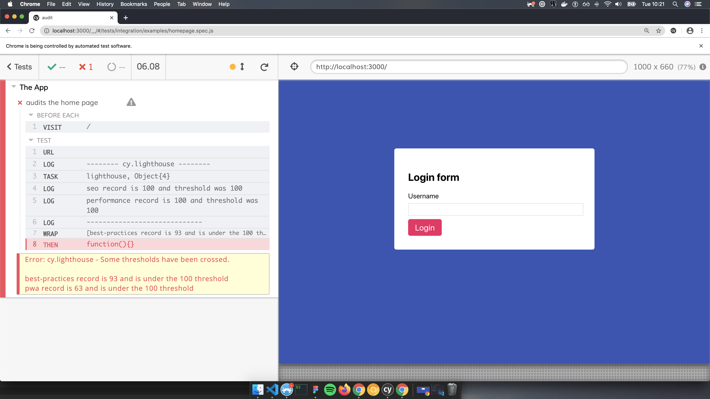

# Installation

:warning: In order to make the `cy.lighthouse()` command available in your project, **there are 3 steps to follow:**

## Installing the dependency

In your favorite terminal:

```sh
$ yarn add -D @cypress-audit/lighthouse
# or
$ npm install --save-dev @cypress-audit/lighthouse
```

## The server configuration

By default, if you try to run Lighthouse from the command line (or from Nodejs), you will see that it opens a new web browser window by default. As you may also know, Cypress also opens a dedicated browser to run its tests.

The following configuration allows Lighthouse and Cypress to make their verifications inside **the same browser (controlled by Cypress) instead of creating a new one**.

### Cypress over v10

In the `cypress.config.js` file, make sure to have:

```javascript
const { lighthouse, prepareAudit } = require("@cypress-audit/lighthouse");
const { kayle } = require("@cypress-audit/kayle");

module.exports = {
  e2e: {
    baseUrl: "http://localhost:3000", // this is your app
    setupNodeEvents(on, config) {
      on("before:browser:launch", (browser = {}, launchOptions) => {
        prepareAudit(launchOptions);
      });

      on("task", {
        lighthouse: lighthouse(),
        kayle: kayle(console.log.bind(console)),
      });
    },
  },
};
```

### Cypress prior to v10

In the `cypress/plugins/index.js` file, make sure to have:

```javascript
const { lighthouse, prepareAudit } = require("@cypress-audit/lighthouse");

module.exports = (on, config) => {
  on("before:browser:launch", (browser = {}, launchOptions) => {
    prepareAudit(launchOptions);
  });

  on("task", {
    lighthouse: lighthouse(), // calling the function is important
  });
};
```

## Making Cypress aware of the commands

When adding the following line in the `cypress/support/commands.js` file, you will be able to use `cy.lighthouse` inside your Cypress tests:

```javascript
import "@cypress-audit/lighthouse/commands";
```

You can then call `cy.lighthouse()` in your Cypress tests.


